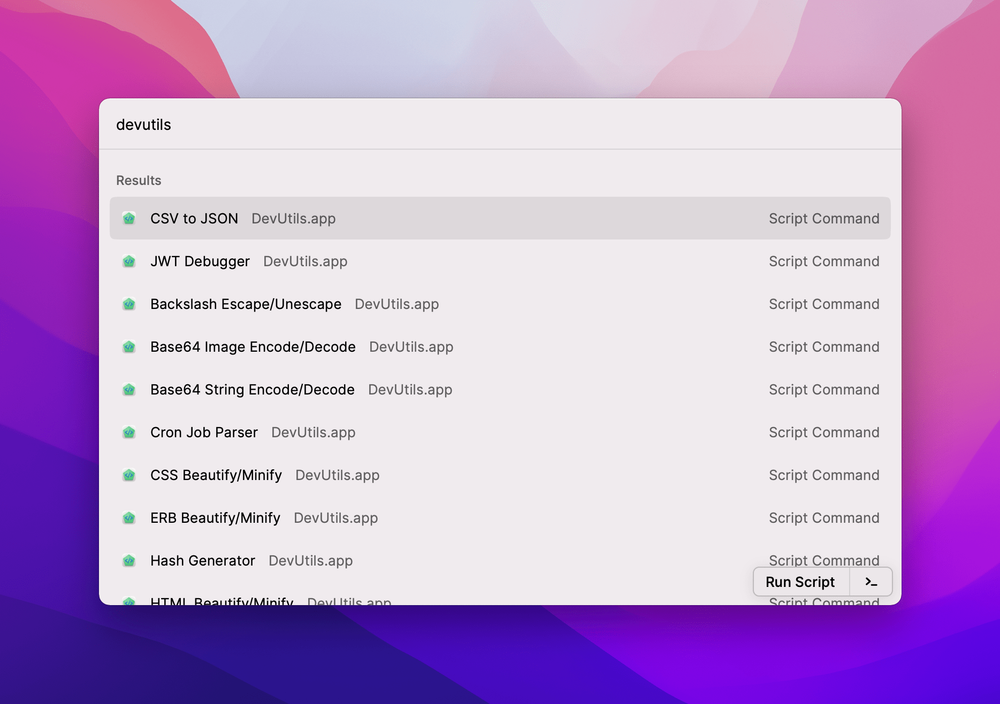
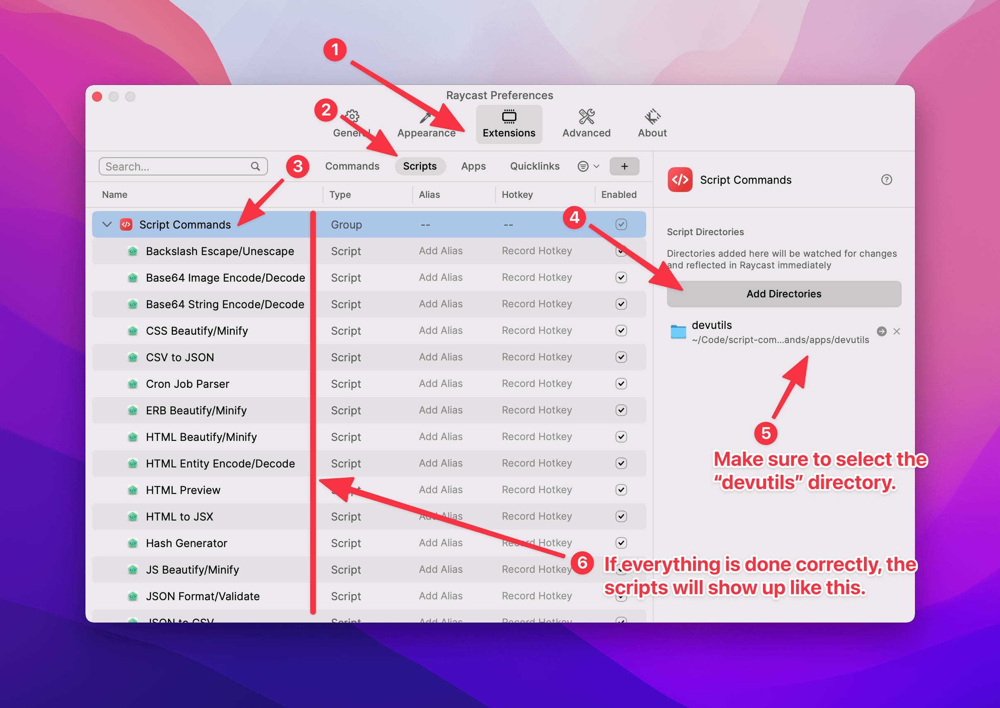

# DevUtils + Raycast ❤️

Official script commands for Raycast.

# Getting started

Requirements:

- [DevUtils](https://devutils.app) (Version 1.13+)
- [Raycast](https://raycast.com)

# Install the script commands

1. Download the repo as a zip and extract.
2. Open Raycast Preferences window and follow this instruction:

# List of commands

Please see https://devutils.app/integrations/ for the full list of supported commands.

The files inside the `devutils` directory are auto-generated, if you spot an error or want to contribute, please open an issue to discuss first 😄

# Need help?

Feel free to contact support@devutils.app

